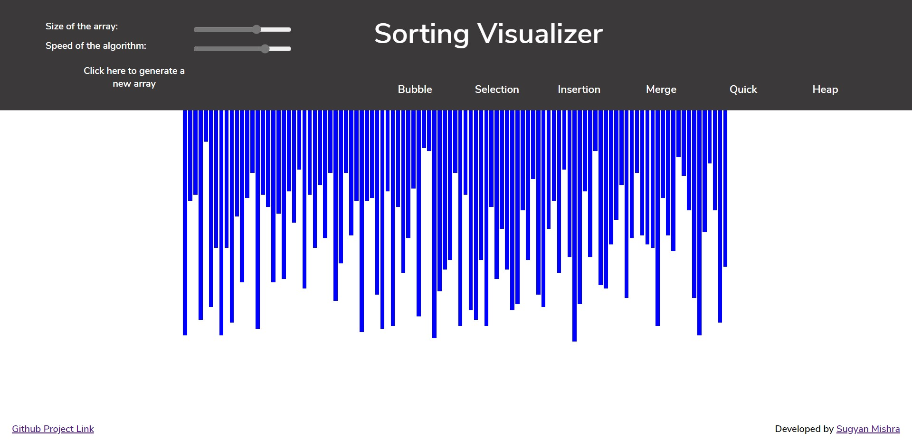

# Sorting Visualizer

This project uses Javascript to visualise sorting algorithms.
User can generate an array, adjust its size and speed of the sorting process after which Bubble, Selection, Insertion, Merge, Quick or Heap sort can be illustrated.
  
<h3><a href="https://sorting-visualiser-1999.herokuapp.com/">Click here to visit live website</a><h3>
  
<!--  -->

  

  